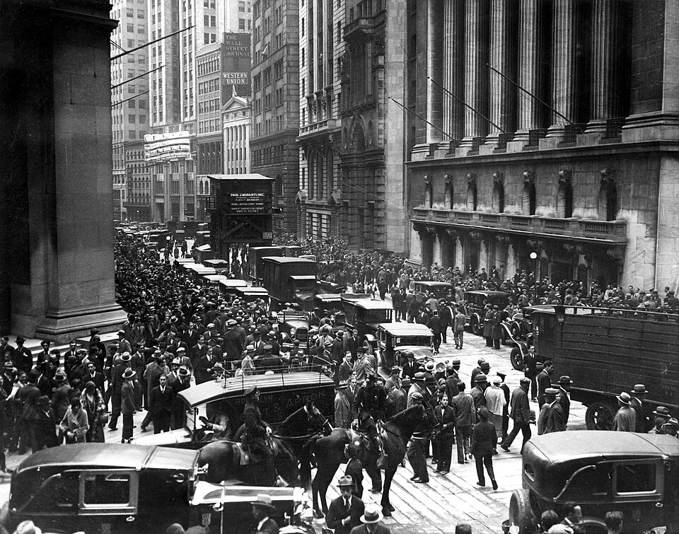

While we don't necessarily expect economic history to repeat itself,
it can help to look for some possible rhymes.

Jacob Weisberg starts [his New York Review of Books
review](https://www.nybooks.com/articles/2026/03/26/tick-tick-boom-1929-andrew-ross-sorkin/)
of Andrew Ross Sorkin's new book [*1929: Inside the Greatest Crash in
Wall Street History—and How It Shattered a
Nation*](https://sites.prh.com/1929) by describing some common beliefs
about the AI boom:

> The current boom in artificial intelligence stands apart for its
> lack of denial. The notion that we are in the frothy, hype-driven
> phase of technological speculation has become conventional
> wisdom. Venture capitalists and technologists openly acknowledge
> that valuations are inflated, expectations are overblown, and vast
> sums of capital are chasing both promise and illusion. Rather than
> contesting the bubble’s existence, they embrace it as not only
> inevitable but perhaps even essential to the breakthroughs
> ahead. This marks a subtle but significant evolution: where previous
> bubbles were about believing in the impossible, the current one
> seems to involve believing in the bubble itself.

Weisberg describes economists Carlota Perez's supposition that bubbles
can result in investment that overreaches but can result in creating
infrastructure that ends up as the foundation for new technologies. A
major example being overbuilding of railroad lines which ended up
making the industrial revolution possible. Another example is the
overbuilding of fiber infrastructure which caused the failure of many
companies, but paved the way for the growth of the internet.

You can imagine that the datacenter boom might be a new case of this
phenomenon, although Weisberg fears that chip obsolescence might make
their capabilities less general purpose and more likely to lose value.

After spending time on the Sorkin *1929* book, John Kenneth
Galbraith's [*The Great Crash,
1929*](https://en.wikipedia.org/wiki/The_Great_Crash,_1929), and
Liaquat Ahamed’s 2009 book [*Lords of
Finance*](https://en.wikipedia.org/wiki/Lords_of_Finance), Weisberg
brings up features of the AI boom that might make it hard to temper or
moderate with modern tools: private credit markets, off-balance-sheet
vehicles, and co-finance arrangements. These financing mechanisms that
move risk outside the regulated banking system, hiding the true scale
and interconnectedness of AI borrowing from regulators in ways that
echo the opaque mortgage structures that triggered the 2008 collapse.

In particular, the co-financing arrangements where AI software and
hardware companies invest in each other in deals often confuse
attempts to assign value and end up injecting heightened demand into
an already fevered investing atmosphere.

It is good that most of the players realize that the AI boom has all
of the calling cards of a speculative bubble and that bubbles can have
redeeming characteristics. However, as Weisberg notes, we should be
looking at crashes like 1929 and 2008 to understand how we can cushion
our landing.
