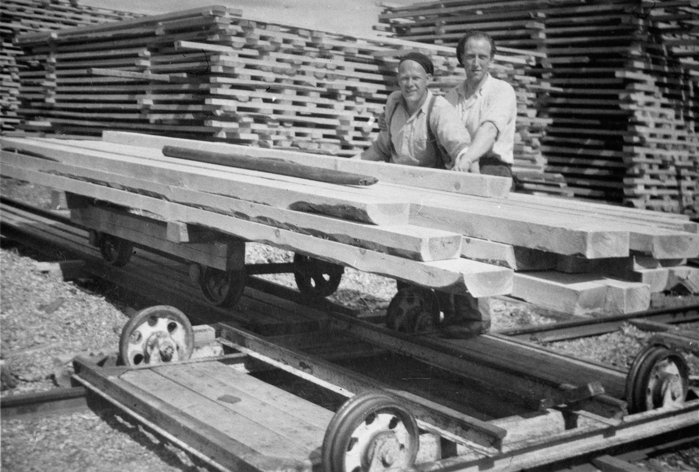
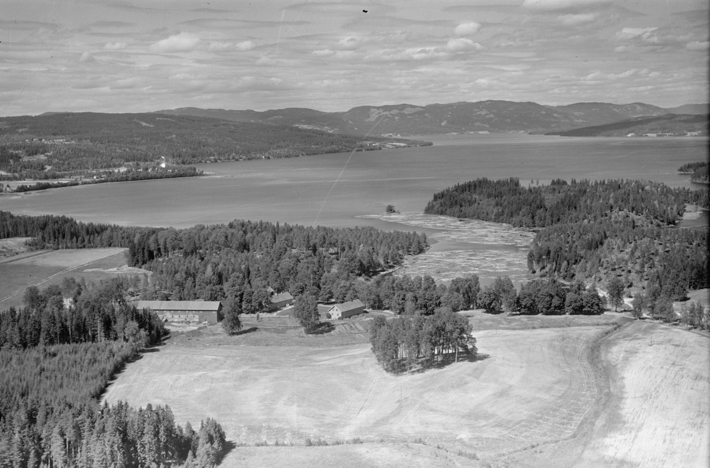

*I have been looking at geneological records and family photographs
and documents to better understand when and why my ancestors came to
America. This is the immigration story of my great-grandmother Anna
Benson who was born in Norway, traveled with her family to Marseilles,
Illinois in 1893, and made a home in the Hyde Park neighborhood of
Chicago with her husband, Swan Benson, and eight children.*

{group="photos"}

My father's father's mother Anna Benson, née Anna Kristina
Bernstdatter, was born on February 7, 1875 in Akershus County, Norway,
northwest of Oslo. She was the sixth of nine children of Bernt Olsen
and Berte Kristine Olsdatter. All of the children were born in Norway,
and later emigrated to America.

There is a great deal of useful information in Anna's birth record
from archived and scanned Norwegian church records.

{group="photos"}

The translation of the highlighted section is:

- **Date of Birth:** 7th of February, 1875
- **Date of Baptism:** 25th of March, 1875 
- **Child's full Name:** Anna Kristine
- **Whether legitimate or illegitimate birth:** Legitimate 
- **Parent's full Names, civil occuption and place of residence:** Day
  laborer Bernt Olsen and Berte Kristine Olsdatter, residing at Berger
  Eie (an owner/tenant farm property at Berger).

There are similar scanned church records for all eight of Anna's
siblings.

We also have a great resource with a first hand account of the
family's life in Norway from Anna's older brother Christ Olsen in a
typed document I was given by my Grandmother Katherine Benson.

## Lumber harvesting and sawing on the Burger Bruk estate

Here is an excerpt on the family's life from the biographical sketch
from Christ Olsen, née Kristian Berntsen.

> The name of the township where we lived was Eidsvold, which is about
> 40 English miles from Oslo. The name of the large estate was
> Berger. To describe the beauty of nature is beyond my ability: the
> fertile soil in the valleys and hills; the mountains beautifully
> covered with evergreens, white and hard pine trees and shrubs; the
> river large and small; and inland lakes with a plentiful variety of
> fish to satisfy the happy fisherman.
>
> Our home was at the narrow end of a lake that was from one-half to
> three miles wide and eight miles long. In the winter it was fine for
> skating and in the summer for boating, fishing and swimming. The
> lake was beautifully surrounded with rocks, hills, woods and
> farmland.
>
> The house where we lived was built up on a hill about two hundred
> feet from the lake with a mountain on the other side behind the
> house. The house was a two story building with sixteen apartments
> with an outside porch the whole length of the building. Each
> apartment had two rooms, size eighteen by twenty feet, with two
> windows in each room.
>
> From our bedroom windows we could see the lake and also the sawmill,
> which was at the narrow end of the lake. Many kinds of berries grew
> in the woods and on the hills, which we enjoyed in the summer until
> the frost came. We did not put any of them away for the winter,
> because no cans or jars were available nor did we have any money to
> spare for sugar.
>
> A shed was provided for each family and also a pen, where we could
> raise a pig. Sometimes we bought a small one in the spring and in
> the fall we killed it and that was our winter supply of meat as long
> as it lasted. When we did not have the pig and when my father could
> afford it, we bought a steer or a heifer. Some men would come around
> with a herd of cattle and I well remember as a lad how my father let
> me come with him to the market place and we led the cow home. We
> hired a man to butcher it for us. My father sent the hide to a
> tannery. That was how we got leather for our shoes. We also had a
> shoemaker at our house for two weeks at times making a pair of shoes
> for each one of us, which had to last us for a whole year.

There was enough information in the biographical sketch to indentify
the exact location of the estate and sawmill in Eidsvold.

{group="photos"}

The Bergen Bruk estate was at the southern end of Hurdal Lake,
northwest of present-day Oslo. It was home to a sawmill and glassworks
where the family worked, lived, and went to school.

{group="photos"}

The Olsen/Olsdatter family worked to fell trees in the forest and then
saw the trees into boards in the sawmill. From Christ Olsen's biography:

> When the sawmill was running in summer, all the children of the
> community, who were eight or nine years old or older, worked piling
> up the wood that came from the mill. We were paid by the cord, which
> was a way of measuring wood. When we were grown up we worked in the
> sawmill during the summer and were out in the woods in the winter
> cutting down trees into logs. Sometimes we were sent many miles from
> home. We would bring a week's supply of food and slept in a log
> cabin with about twelve men in each. The straw filled bunks we slept
> in were only about two feet high. We had to keep our clothes on all
> week.
>
> The snow was from five to eight feet deep and at times it would be
> down to thirty degrees below zero. We had to shovel the snow away
> from around the tree before we were allowed to cut it, so that the
> stumps would not be too high. The snow was so hard on top that we
> could walk on it and even drive a team of horses and sled on top.
    
> The mill was run by a very large steam plant. The building housing
> the mill was two stories high with the saws upstairs. Each saw had a
> heavy steel frame containing seven to fourteen blades. There were
> five of these saws. The whole log was cut at one time into boards of
> from one to three inches in thickness. The logs were from six inches
> at the smallest end to four feet thick at the largest end. We were
> paid 7 öre (about 3 cents) for each log.

::: {layout-ncol=2}
{group="photos"}

{group="photos"}

{group="photos"}

{group="photos"}
:::

## Brothers to America

Christ Olsen describes how his older brothers moved to the United
States before they turned 21, the age of mandatory military service in
Norway.

> The oldest member of our family, Brother Ole, was the first one to
> go to the promised land, the United States of America. He was then
> nearly twenty years of age. Then a little later Brother Martin and
> Brother John, who was only eighteen years old, sailed for
> America. They all left before they had to serve as a soldier in the
> Norwegian army. All men at the age of 21, who were in good health,
> were drafted.

The mandatory military service was not the only reason to leave
Norway&mdash;Christ himself served for two years in the military, was
promoted to Corporal and received better wages than at the
sawmill. Christ's description of the family's economic situation gives
evidence of an additional economic motivation for emigration.

> From our bedroom windows we could see the lake and also the sawmill,
> which was at the narrow end of the lake. Many kinds of berries grew
> in the woods and on the hills, which we enjoyed in the summer until
> the frost came. We did not put any of them away for the winter,
> because no cans or jars were available nor did we have any money to
> spare for sugar.
>
> A shed was provided for each family and also a pen, where we could
> raise a pig. Sometimes we bought a small one in the spring and in
> the fall we killed it and that was our winter supply of meat as long
> as it lasted. When we did not have the pig and when my father could
> afford it, we bought a steer or a heifer. Some men would come around
> with a herd of cattle and I well remember as a lad how my father let
> me come with him to the market place and we led the cow home. We
> hired a man to butcher it for us. My father sent the hide to a
> tannery. That was how we got leather for our shoes. We also had a
> shoemaker at our house for two weeks at times making a pair of shoes
> for each one of us, which had to last us for a whole year.

In the late 1800s Norway was [facing a depression beginning in the
1870s](https://eh.net/encyclopedia/the-economic-history-of-norway/)
caused by a variety of factors including a slowdown of exports. This
led to a large-scale emigration with a peak in 1882.

## Leaving for America

Christ Olsen describes the journey to America of the remaining members
of the family.

> After a long discussion between Father and Mother, it was decided to
> go to the U. S. A. I promised to stay with them in America until
> they were able to take care of themselves. Uncle John, who was then
> living in America, sent us money for the tickets. A few years before
> this we had also planned to go, but our parents could not agree and
> so we sent the money John had given at that time back to him. This
> time we definitely planned to leave.
> 
> We left Oslo in the middle of February, 1893. The narrow lake going
> from Oslo to Bergen in the southern part of Norway was frozen over
> with two feet of ice. They had a large boat go ahead of our ship to
> break up the ice. At Bergen it was found that our ship had not been
> damaged and so it continued the journey across the ocean. It was
> almost three weeks before we reached New York.
> 
> We had stormy weather on the ocean most of the way. One Sunday we
> were told that we only went two miles because of the high waves
> washing over the deck. One day three other young men and I were
> sitting on the upper deck, when suddenly a great wave washed over
> the deck and swept us off our chairs and nearly washed us
> overboard. We all got a good soaking. When I came down to my folks,
> Mother was crying and said that she did not expect to see me alive.

{group="photos"}

{group="photos"}

This seems to be when the family's names went from their Scandanavian
patronymic names to an Olsen surname.

- *Bernt Oleson* to *Bernt Olsen*
- *Berthe Kristina Olsdatter* to *Kristena Olsen*
- *Anna Kristine Berntsdatter* to *Anna Olsen*
- etc.

Sister Mina Gulbrandson, née Mina Bernstdatter, arrives later in 1902
with her husband Martin Gulbrandson.

## Settling in and around Marseilles, Illinois

Things weren't always easy in their new life in the U.S. as described
by Christ Olsen.

> From New York we took the train to Marseilles, Illinois, where my
> brothers lived. Father worked for Brother Ole during the first
> summer. Ole got a job for me as a hired man for a Norwegian neighbor
> at $18 a month plus room and board. I started work at 5:00 A.M. and
> kept on until 10:00 P.M. On Sundays I walked four miles to Seneca to
> a prayer meeting. The following year I earned $20 a month. I did not
> get enough to eat and so in four months I got sick and had had to go
> home to the folks. After going back to work for another family
> Mother came to see me one day after walking three miles and brought
> me a pie. For five years I rented a large farm together with my
> father. Then at the age of thirty-three years of age I sold my
> belongings to Brother Bert and left for Chicago.

Anna Olsen met a Swedish immigrant from Chicago named Swan Benson and
they were married in Marseilles in 1895.

{group="photos"}

## Hyde Park, Chicago

Swan and Anna Benson settled in Hyde Park, Chicago and by 1900 they
had two sons, William and Albert, with my father's father Harold
Walter Benson on the way.

{group="photos"}

Brother Christ Olsen visited sister Anna and brother-in-law Swan in
Chicago and came to attend the Hyde Park Swedish Methodist Church
where he met his wife Hannah and was married on April 20, 1901.  Both
Swan and Christ were on the Board of Directors for the Hyde Park
church.

{group="photos"}

In the 1910 Census they had moved to 5487 Madison Avenue (now
Dorchester Avenue) with six kids. It is interesting that the other
families at the same address were Charley Nylin (from the Hyde Park
Church board photo) and Gustaf Tornquist who also appears in the
church membership roles.

{group="photos"}

Unfortunately, Swan Benson died in 1915. By 1920, Anna Benson and her
seven kids were living at 5325 Dorchester Avenue where she would stay
until moving in with daughter Mabel in the late 1940s.

{group="photos"}

{group="photos"}

While I didn't meet my great-grandmother&mdash;she died 6 months after
I was born&mdash;I knew her son, my Grandfather Walter Benson, very
well and I loved learning more about her early life in Norway and how
she ended up in Hyde Park, Chicago where my grandfather and father
grew up.

