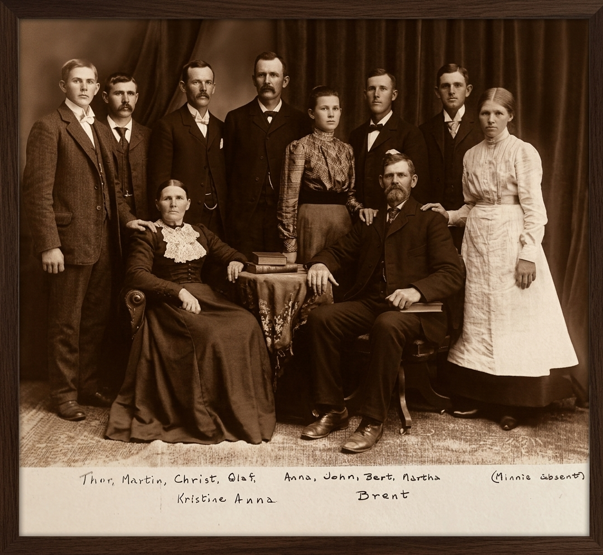

{group="photos"}

I have been looking at ancestry and geneological records to better
understand when and why my ancestors came to America. This is the
emigration story of my great-grandmother Anna Benson from Norway to
America in late 1800s.

My father's father's mother Anna Benson, née Anna Kristina
Bernstdatter, was born on February 7, 1875 in Eidsvold, Norway. She
was the sixth of nine children of Bernt Olsen and Berte Kristine
Olsdatter, all of whom were born in Norway, and later emigrated to
America.

Here is her birth record from archived church records.

{group="photos"}

The translation of the highlighted section is:

- **Date of Birth:** 7th of February, 1875
- **Date of Baptism:** 25th of March, 1875 
- **Child's full Name:** Anna Kristine
- **Whether legitimate or illegitimate birth:** Legitimate 
- **Parent's full Names, civil occuption and place of residence:** Day
  laborer Bernt Olsen and Berte Kristine Olsdatter, residing at Berger
  Eie (an owner/tenant farm property at Berger).

There are similar records for all eight of Anna's siblings. We can
learn more about their early lives in Norway from her older brother
Christ's writings.

## Lumber harvesting and sawing on the Burger Bruk estate

Anna's brother Christ Olsen, née Kristian Berntsen, wrote a
biographical sketch of his life in Norway and the family's emigration
to America that provides important details.

> The name of the township where we lived was Eidsvold, which is about
> 40 English miles from Oslo. The name of the large estate was
> Berger. To describe the beauty of nature is beyond my ability: the
> fertile soil in the valleys and hills; the mountains beautifully
> covered with evergreens, white and hard pine trees and shrubs; the
> river large and small; and inland lakes with a plentiful variety of
> fish to satisfy the happy fisherman.
>
> Our home was at the narrow end of a lake that was from one-half to
> three miles wide and eight miles long. In the winter it was fine for
> skating and in the summer for boating, fishing and swimming. The
> lake was beautifully surrounded with rocks, hills, woods and
> farmland.
>
> The house where we lived was built up on a hill about two hundred
> feet from the lake with a mountain on the other side behind the
> house. The house was a two story building with sixteen apartments
> with an outside porch the whole length of the building. Each
> apartment had two rooms, size eighteen by twenty feet, with two
> windows in each room.
>
> From our bedroom windows we could see the lake and also the sawmill,
> which was at the narrow end of the lake. Many kinds of berries grew
> in the woods and on the hills, which we enjoyed in the summer until
> the frost came. We did not put any of them away for the winter,
> because no cans or jars were available nor did we have any money to
> spare for sugar.
>
> A shed was provided for each family and also a pen, where we could
> raise a pig. Sometimes we bought a small one in the spring and in
> the fall we killed it and that was our winter supply of meat as long
> as it lasted. When we did not have the pig and when my father could
> afford it, we bought a steer or a heifer. Some men would come around
> with a herd of cattle and I well remember as a lad how my father let
> me come with him to the market place and we led the cow home. We
> hired a man to butcher it for us. My father sent the hide to a
> tannery. That was how we got leather for our shoes. We also had a
> shoemaker at our house for two weeks at times making a pair of shoes
> for each one of us, which had to last us for a whole year.

There was enough information in the biographical sketch to indentify
the exact location of the estate and sawmill in Eidsvold.

{group="photos"}

The Bergen Bruk estate was at the southern end of Hurdal Lake,
northwest of present-day Oslo. It was home to a sawmill and glassworks
where the family worked, lived, and went to school.

{group="photos"}

The Olsen/Olsdatter family worked to fell trees in the forest and then
saw the trees into boards in the sawmill.

{group="photos"}

The resulting boards were transported to the rail station in Dal by
horse-drawn rail cars.

{group="photos"}

